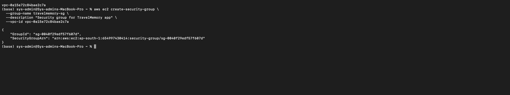
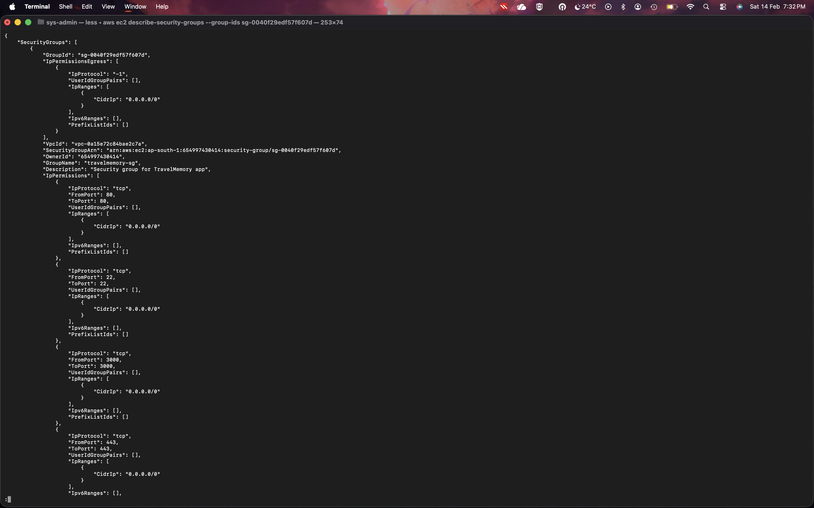
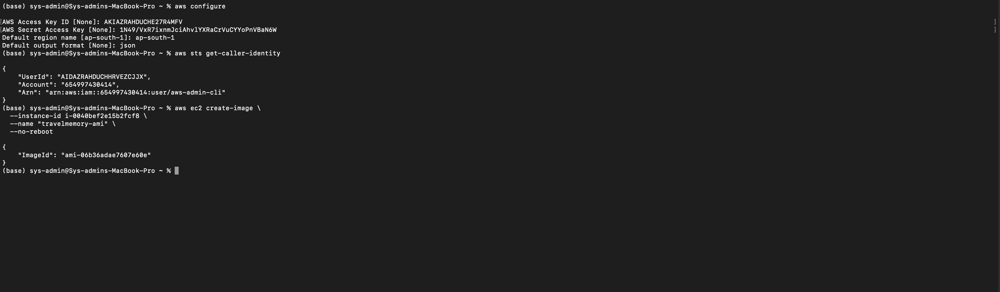
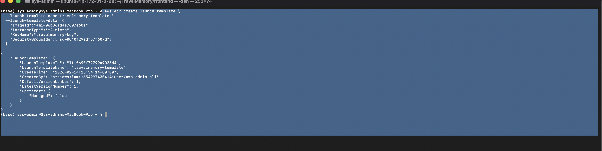
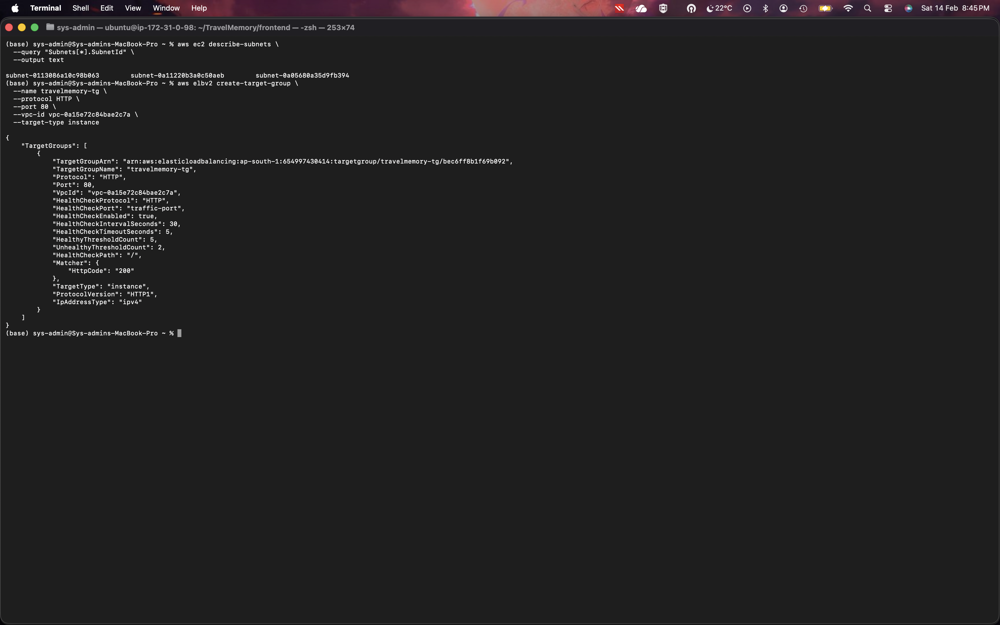
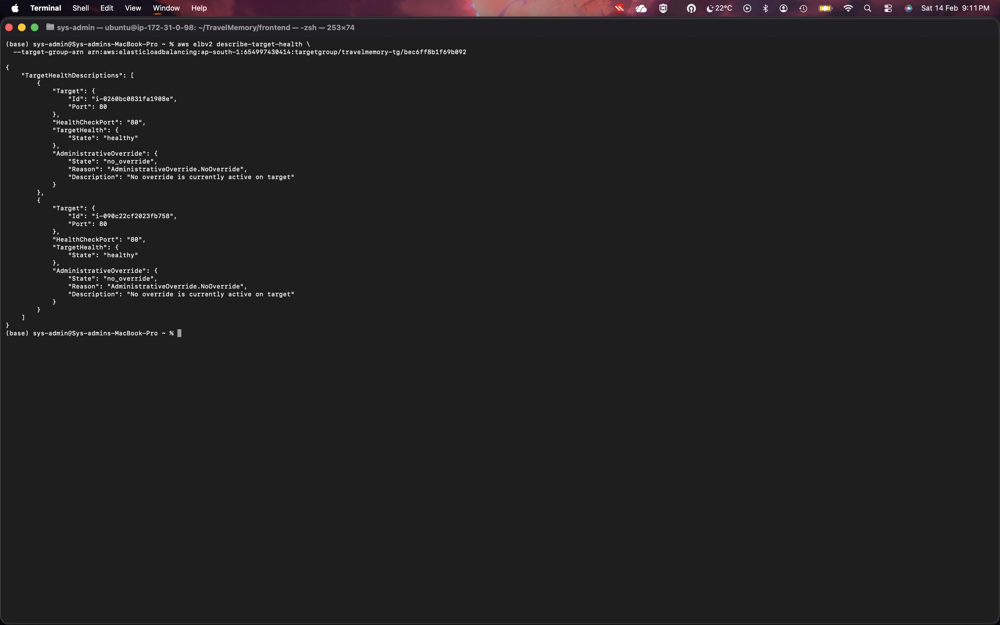
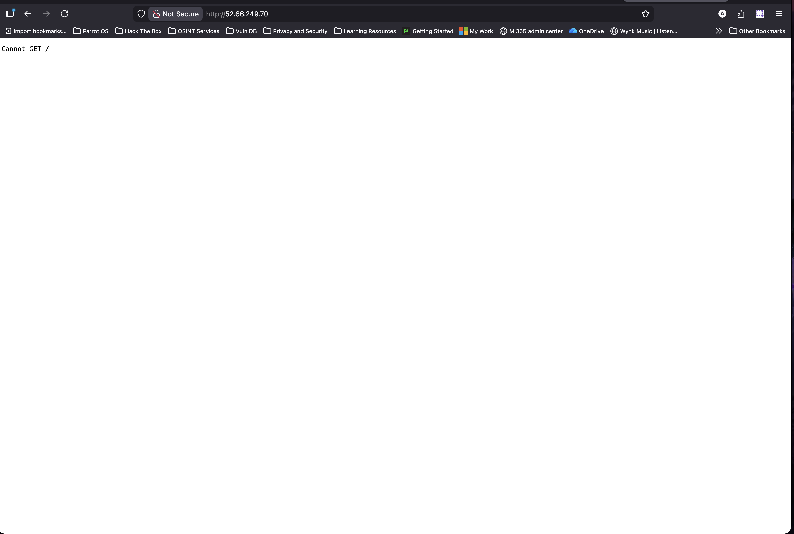
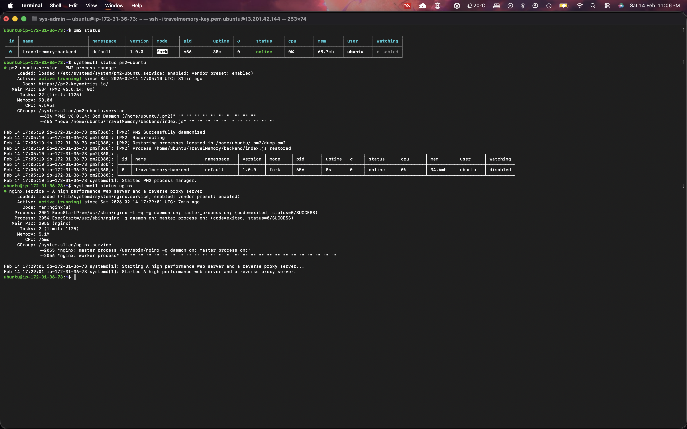

# TravelMemory - Deployment on AWS EC2

## 📌 Project Overview

TravelMemory is a full-stack MERN application deployed on AWS EC2.
This deployment includes a production-ready setup with Nginx reverse proxy,
PM2 process manager, custom domain, and HTTPS using Let's Encrypt.

---

## 🌐 Live Application URL

https://travelmemory-654997.duckdns.org

---

## 🏗️ Deployment Architecture

Client (Browser)
        ↓
Nginx (Reverse Proxy)
        ↓
Node.js Backend (PM2)
        ↓
Database

---

## 🖥️ Server Configuration

- Cloud Provider: AWS EC2
- Operating System: Ubuntu 22.04 LTS
- Web Server: Nginx
- Process Manager: PM2
- Runtime: Node.js v18
- Domain Provider: DuckDNS
- SSL Certificate: Let's Encrypt (Certbot)

---

## ⚙️ Deployment Steps Summary

### 1️⃣ EC2 Setup
- Created EC2 instance (Ubuntu 22.04)
- Configured Security Groups (Ports 22, 80, 443)
- Connected via SSH

### 2️⃣ Backend Setup
- Cloned TravelMemory repository
- Installed dependencies
- Started backend using PM2
- Configured PM2 to run on system startup

### 3️⃣ Nginx Configuration
- Installed Nginx
- Configured reverse proxy
- Enabled React routing support
- Restarted Nginx service

### 4️⃣ Frontend Build
- Built React frontend for production
- Deployed build files to /var/www/html

### 5️⃣ Domain Setup
- Registered subdomain using DuckDNS
- Pointed domain to EC2 public IP

### 6️⃣ HTTPS Configuration
- Installed Certbot
- Generated SSL certificate
- Configured automatic HTTP → HTTPS redirection

---

## 🔄 Application Management

Restart Application:

##pm2 restart travelmemory-backend
-View Logs:

##pm2 logs

-Check Running Processes:

## pm2 status

---

## 📸 Deployment Screenshots

### EC2 Instance Creation

### Security Group Configuration

### AMI Creation

### Launch Template

### Target Group Creation

### Application Load Balancer

### Target Health - Healthy

### Nginx Reverse Proxy Configuration

### PM2 Running Backend

### HTTPS Enabled

### Final Application Running

